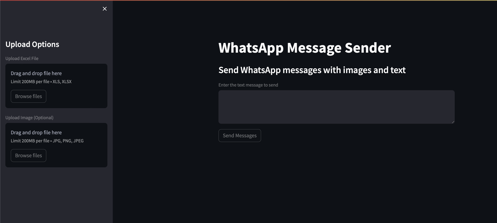

# WhatsApp Message Sender

## Description
This Streamlit app allows users to send WhatsApp messages with images and text to multiple phone numbers using an Excel sheet as input. It utilizes Selenium for web automation to interact with the WhatsApp Web interface.

## Features
- Upload an Excel file with phone numbers.
- Upload an optional image to send along with the text message.
- Handle errors and exceptions gracefully.
- Attractive and user-friendly interface.

## How to Use
1. Upload an Excel file with phone numbers in the sidebar.
2. Optionally, upload an image to send along with the text message.
3. Enter the text message in the text area.
4. Click the "Send Messages" button to start sending WhatsApp messages.

## Requirements
- Python 3.x
- Streamlit
- Selenium
- pandas

## Usage
1. Clone the repository.
2. Install the required dependencies using `pip install -r requirements.txt`.
3. Run the app locally with `streamlit run app.py`.

## Note
- Make sure to have the latest version of Google Chrome and the Chrome WebDriver installed on your machine.

## Credits
- This app was developed by [Muhammed Waqar Ahmed](https://github.com/MWA-CH/).

## License
- This project is licensed under the [MIT License](LICENSE).
